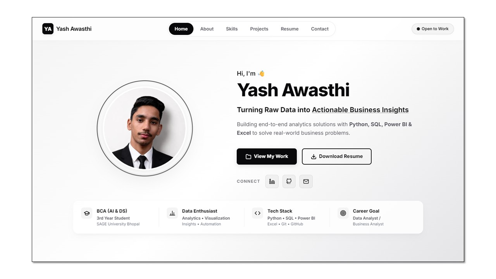

# Yash Awasthi — Personal Portfolio

Welcome to my personal portfolio repository! This is a modern, high-performance, single-page web portfolio showcasing my projects, skills, and background as an aspiring Data Analyst and Student at SAGE University Bhopal.
- 🌐 **Live Portfolio:** https://yashawasthi27.github.io/Portfolio/
- 

## ✨ Core Features & Optimizations

- **Modern Palette**: A carefully curated, professional color scheme with sleek transitions and fully responsive layouts.
- **Parallax Ocean Waves**: Animated, overlapping SVG waves at the bottom of the page creating an atmospheric, smooth drift effect.
- **Sophisticated Noise Overlay**: A clean SVG-based soft-grain texture filter running efficiently on top of the layout.
- **High Performance & Optimization**:
  - **In-Memory Caching**: Implemented a caching layer for GitHub README requests so clicking project cards loads details instantly.
  - **Hardware Acceleration**: Promoted scroll-reveal modules to composite GPU layers via `will-change` for stutter-free page scrolling.
  - **Nav Selection Caching**: Optimized navigation link states by caching node lookups, avoiding layout shifts and CPU thrashing during scrolling.
- **Clipboard Integration**: Single-click copy-to-clipboard functionality to instantly grab my email address.

## 🛠️ Tech Stack

  
  
  
  
  
   
  
  
  
   
  
  
  

- **Frontend Core**: Semantic HTML5 & Modern CSS3 (CSS Variables, Flexbox, Keyframe Animations)
- **Vanilla JavaScript**: Lightweight interactions, IntersectionObserver API, dynamic GitHub README integration, and Clipboard API.
- **Markdown Rendering**: Marked.js (for client-side repository README parsing)

## 📫 Connect with me

- **LinkedIn**: [Yash Awasthi](https://www.linkedin.com/in/yashawasthi27/)
- **GitHub**: [@yashawasthi27](https://github.com/yashawasthi27)
- **Email**: yashonwork247@gmail.com
