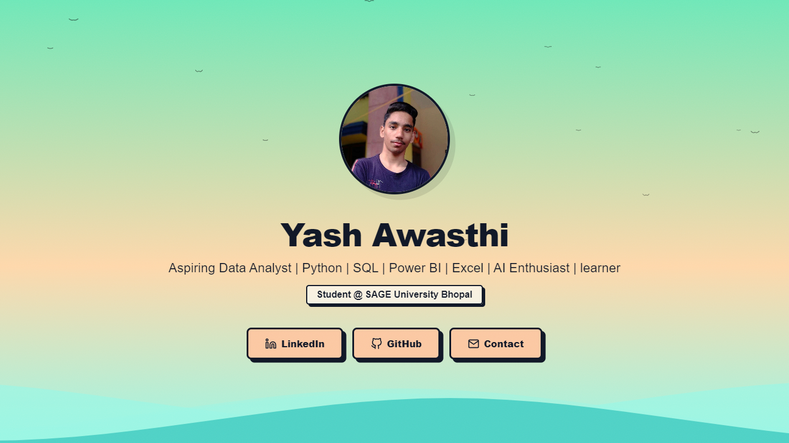

# Yash Awasthi | Personal Portfolio

Welcome to my personal portfolio repository! This is a refined, single-page web portfolio showcasing my background as an aspiring Data Analyst and AI enthusiast and Student @ SAGE University Bhopal.

## ✨ Features

- **Dynamic Day/Night Theme**: The website intelligently uses your local system time to dynamically switch between a bright "Day Mode" (mint and peach gradients) and a sleek "Night Mode" (midnight and indigo gradients).
- **Flocking Birds Canvas**: A lightweight, custom-built HTML5 `<canvas>` animation of flocking birds gracefully overlapping the background.
- **Parallax Ocean Waves**: Animated, overlapping SVG waves located at the bottom of the screen to create a calm, atmospheric parallax drift effect.
- **Noise Texture Overlay**: The entire webpage features a sophisticated soft-grain texture achieved entirely through SVG noise filters. 
- **Clipboard Integration**: A clean, single-click copy-to-clipboard functionality to quickly grab my email address.

## 🛠️ Tech Stack

- **HTML5**
- **CSS3** (Custom Properties, Flexbox, SVG Parallax Animations)
- **Vanilla JavaScript** (Canvas API for mathematical bird flight patterns, Clipboard API, Date Math)

## 🚀 How to Run locally

1. Simply clone or download the repository to your local machine.
2. Open the `index.html` file using any modern web browser (Google Chrome, Firefox, Safari, Edge).
3. No build tools, extra installations, or development servers are required!

## 📫 Connect with me

- **LinkedIn**: [Yash Awasthi](https://www.linkedin.com/in/yashawasthi27/)
- **GitHub**: [@yashawasthi27](https://github.com/yashawasthi27)
- **Email**: yashonwork247@gmail.com
