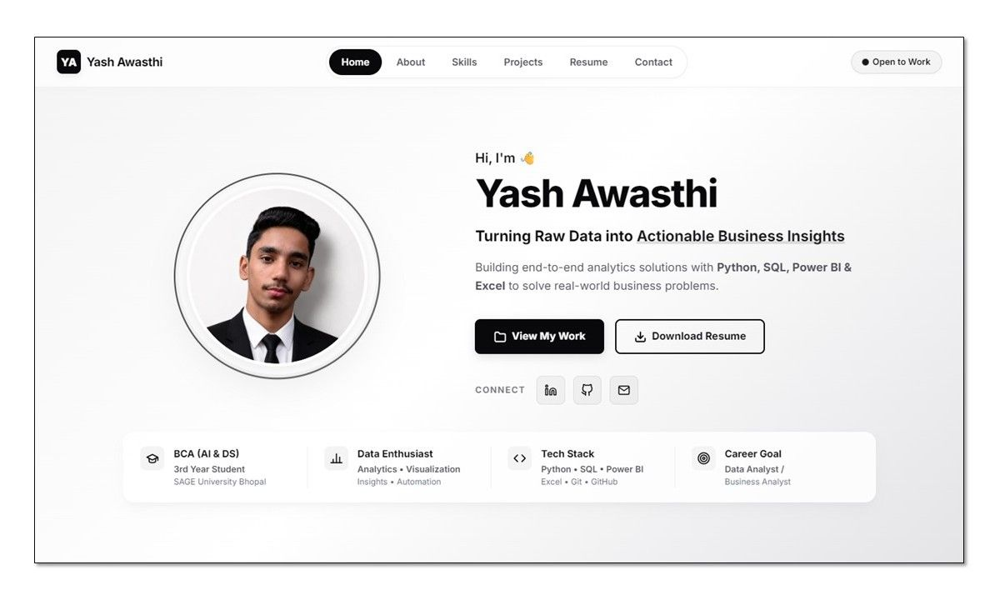

# Yash Awasthi — Personal Portfolio

Welcome to my personal portfolio repository! This is a modern, high-performance, single-page web portfolio showcasing my projects, skills, and background as an **Aspiring Data Analyst** and student at SAGE University, Bhopal.

**Live site**: [yashawasthi27.github.io/Portfolio](https://yashawasthi27.github.io/Portfolio/)

## ✨ Core Features

- **Minimalist Monochrome Design**: A clean, black-and-white design system with subtle glassmorphism, smooth transitions, and full responsiveness across desktop and mobile.
- **Unified Navbar**: Logo, centered navigation (Home / About / Skills / Projects / Resume / Contact), and social links (LinkedIn/GitHub/Email) all in one sticky bar — collapses into a hamburger menu with a scroll-locked background on mobile.
- **Hero Section**: Profile photo with glow effect, quick intro, primary CTAs ("View My Work" / "Download Resume"), and a "Let's talk" link into the contact section, backed by a four-item quick-overview strip (Education, Focus, Tech Stack, Career Goal).
- **Scroll-Reveal Animations**: Sections and cards fade/slide into view using the `IntersectionObserver` API — no scroll-position polling, no layout thrashing.
- **Smooth Scrolling**: Lenis-powered 60fps eased scrolling across the page.
- **Live Project Details**: Clicking a project card opens a modal that fetches that repo's README directly from GitHub and renders it client-side, with embedded fallback content for offline/error cases.
- **In-App Resume Preview**: Resume links open an inline PDF preview modal instead of navigating away, alongside a direct download option.
- **Contact Form**: Client-side validated contact form (name, email, subject, message with live character counter) with a honeypot field for spam protection.
- **Clipboard Integration**: One-click copy-to-clipboard for my email address, with a toast confirmation.
- **Back to Top**: Floating button appears after scrolling, smooth-scrolls back to the hero section.

## ⚡ Performance

- **Optimized Assets**: All images (profile photo, logo, project screenshots) are resized and compressed to match their actual display size — total image payload cut by over 90%.
- **Mobile-Aware Blur**: `backdrop-filter` (an expensive GPU operation on sticky elements) is disabled on touch devices in favor of a near-solid background, keeping scroll at a steady frame rate on phones.
- **`content-visibility: auto`** on off-screen project cards so the browser skips rendering work until they're needed.
- **In-Memory README Caching**: Repeated clicks on the same project card reuse the cached GitHub response instead of re-fetching.
- **Cached Nav Lookups**: Navigation link elements are queried once and cached in a map, avoiding repeated DOM lookups during scroll.
- **Passive Scroll Listeners** + `requestAnimationFrame` throttling on scroll-driven UI (e.g. the back-to-top button).
- **Cache-Busted Assets**: Versioned stylesheet query strings (`index.css?v=`) paired with no-cache meta headers to ensure visitors always see the latest deploy.

## 🗂️ Featured Projects

- **HR Attrition Dashboard** — End-to-end HR analytics & employee attrition dashboard (Python, PostgreSQL, Power BI)
- **Job Salary Dashboard** — Data Analyst job salary dashboard built in Excel (XLOOKUP, FILTER, MEDIAN+IF)
- **Finance Dashboard** — Power BI finance analysis dashboard with DAX measures
- **Sales Analytics** — Power BI sales analytics dashboard
- **Retail SQL Analysis** — E-commerce sales analytics using PostgreSQL and advanced SQL
- **Face Detective** — Biometric face-detection attendance system (TypeScript)

Each project card links to its live GitHub repo and opens a detail modal with the project's rendered README.

## ♿ Accessibility & SEO

- Skip-to-content link, visible `:focus-visible` states, and `aria-current="page"` on the active nav link.
- Open Graph & Twitter Card meta tags for rich link previews, JSON-LD `Person` schema, canonical URL, `robots.txt`, and `sitemap.xml`.

## 🛠️ Tech Stack

- **Frontend Core**: Semantic HTML5 & modern CSS3 (custom properties, Flexbox/Grid, keyframe animations)
- **Vanilla JavaScript**: No frameworks — `IntersectionObserver`, dynamic GitHub README fetching, Clipboard API
- **Smooth Scroll**: [Lenis](https://lenis.darkroom.engineering/)
- **Markdown Rendering**: [Marked.js](https://marked.js.org/) for client-side README parsing

## 📫 Connect with me

- **LinkedIn**: [Yash Awasthi](https://www.linkedin.com/in/yashawasthi27/)
- **GitHub**: [@yashawasthi27](https://github.com/yashawasthi27)
- **Email**: yashonwork247@gmail.com
